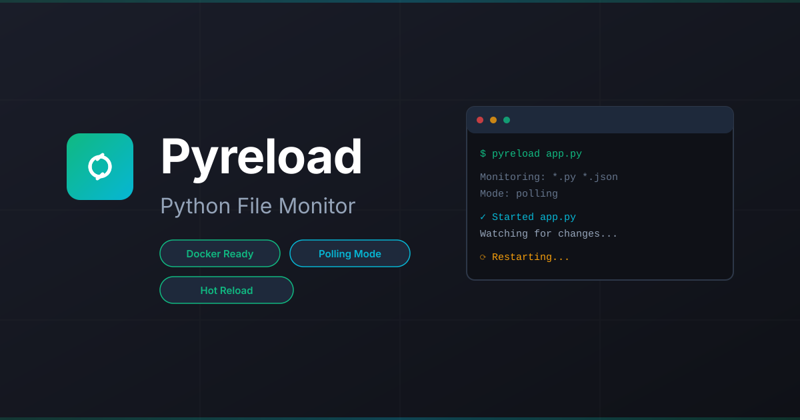

# Pyreload CLI 🔄



**Automatically restart Python applications when file changes are detected**

[](https://pypi.org/project/pyreload-cli)
[](https://pypi.org/project/pyreload-cli)
[](https://github.com/dotbrains/pyreload-cli)
[](https://github.com/dotbrains/pyreload-cli/blob/master/LICENSE)


Pyreload is a modern, easy-to-use file monitoring tool that automatically restarts your Python applications when code changes are detected. Perfect for development workflows with **full support for Docker, Vagrant, and mounted filesystems** via polling mode.

## Features

- 🚀 **Zero-config reloading** - Works with Python files by default
- 📂 **Polling mode** - Solves mounted filesystem limitations (Docker, Vagrant, CIFS/NFS)
- 🎯 **Flexible patterns** - Watch and ignore patterns with glob support
- ⚙️ **Config file support** - `.pyreloadrc` or `pyreload.json` for team settings
- 🧹 **Clean mode** - No logs, no prompts for production-like testing
- 🔧 **Exec mode** - Run any shell command, not just Python files
- ⌨️ **Manual control** - Type `rs` to restart, `stop` to exit

## Quick Example

=== "Basic Usage"

    ```bash
    pip install pyreload-cli
    pyreload app.py
    ```

=== "With Docker"

    ```bash
    pyreload app.py --polling
    ```

=== "With Config"

    ```json
    // .pyreloadrc
    {
      "watch": ["*.py", "config/*.yaml"],
      "ignore": ["*__pycache__*"],
      "polling": true
    }
    ```

## Why Pyreload?

### Polling Mode for Containers

Standard file watching relies on OS-level events (like `inotify`). These events **don't propagate through mounted volumes**. Pyreload's polling mode solves this by directly checking file modification times.

```bash
# Perfect for Docker development
docker run -v $(pwd):/app myapp pyreload app.py --polling

# Or Vagrant
vagrant ssh -c "cd /vagrant && pyreload app.py --polling"
```

### Simple Configuration

Create a `.pyreloadrc` file to share settings with your team:

```json
{
  "watch": ["*.py", "config/*.yaml"],
  "ignore": ["*__pycache__*", "*.log"],
  "debug": false,
  "polling": false
}
```

CLI arguments always override config file settings.

### Multiple Watch Patterns

Watch different file types and directories:

```bash
pyreload app.py -w "*.py" -w "config/*.yaml" -w "templates/*.html"
```

## Getting Started

Head over to the [Installation Guide](getting-started/installation.md) to begin, or jump straight to the [Quick Start](getting-started/quick-start.md) for a 2-minute setup.

## Use Cases

Pyreload excels in these scenarios:

- **[Docker Development](use-cases/docker.md)** - Hot reload in containers with volume mounts
- **[Vagrant Workflows](use-cases/vagrant.md)** - Develop in VMs with synced folders
- **Microservices** - Restart services on code changes
- **API Development** - Auto-reload Flask/FastAPI apps
- **Data Pipelines** - Restart ETL scripts on changes

## Comparison

| Feature | Pyreload | py-mon | nodemon |
|---------|-------|--------|---------|
| Python-native | ✅ | ✅ | ❌ |
| Polling mode | ✅ | ❌ | ✅ |
| Config file | ✅ | ✅ | ✅ |
| Docker/Vagrant | ✅ | ⚠️ Limited | ✅ |
| Zero config | ✅ | ✅ | ✅ |

## Community

- **GitHub**: [dotbrains/pyreload-cli](https://github.com/dotbrains/pyreload-cli)
- **PyPI**: [pypi.org/project/pyreload-cli](https://pypi.org/project/pyreload-cli)
- **Issues**: [Report bugs](https://github.com/dotbrains/pyreload-cli/issues)

## License

MIT License - see [LICENSE](https://github.com/dotbrains/pyreload-cli/blob/main/LICENSE) for details.
