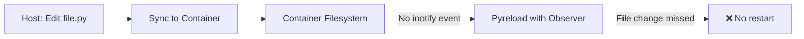
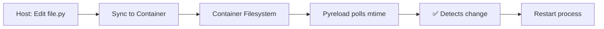

# Polling Mode

Polling mode is Pyreload's solution for file watching in environments where OS-level file system events don't work properly, such as **Docker containers, Vagrant VMs, and network-mounted filesystems** (CIFS, NFS).

## The Problem

Standard file watching uses operating system events like `inotify` (Linux), `FSEvents` (macOS), or `ReadDirectoryChangesW` (Windows). These are efficient and instant, but they have a critical limitation: **they don't propagate through mounted volumes**.

### When OS Events Fail



This happens in:

- **Docker** with volume mounts (`-v` or `volumes:`)
- **Vagrant** with synced folders
- **WSL2** accessing Windows filesystems
- **CIFS/NFS** network shares
- **VirtualBox** shared folders

## The Solution: Polling

Polling mode bypasses OS events entirely. Instead, it directly checks file modification times at regular intervals (default: 1 second).



## Usage

Enable polling mode with the `--polling` or `-p` flag:

```bash
pyreload app.py --polling
```

### With Config File

Set polling in your `.pyreloadrc`:

```json
{
  "polling": true,
  "watch": ["*.py"],
  "ignore": ["*__pycache__*"]
}
```

### CLI Override

CLI flags always override config files:

```bash
# Force event-based even if config has polling: true
pyreload app.py  # No --polling flag

# Force polling even if config has polling: false
pyreload app.py --polling
```

## Performance Considerations

### Polling Interval

Polling checks files every ~1 second by default. This means:

- ✅ Low CPU usage (only checks modified times, not file contents)
- ✅ Works reliably across all mount types
- ⚠️ ~1 second delay before detecting changes
- ⚠️ Higher latency than OS events (which are instant)

### When to Use Polling

| Scenario | Use Polling? | Reason |
|----------|--------------|--------|
| Docker development | ✅ Yes | Volume mounts don't propagate events |
| Vagrant with synced folders | ✅ Yes | VirtualBox/VMware shares don't send events |
| WSL2 → Windows files | ✅ Yes | Cross-filesystem boundary |
| Native Linux/macOS dev | ❌ No | OS events are faster and more efficient |
| CIFS/NFS mounts | ✅ Yes | Network shares don't support inotify |
| Local development | ❌ No | Use default event-based mode |

### Resource Usage

Polling uses minimal resources:

```bash
# Typical polling CPU usage: <1%
# Memory overhead: negligible
```

For comparison:

- **Event-based** (default): ~0% CPU, instant detection
- **Polling mode**: ~0.5% CPU, ~1s delay

## Docker Example

### Without Polling (Won't Work)

```dockerfile
FROM python:3.11-slim
WORKDIR /app
COPY . .
CMD ["pyreload", "app.py"]  # ❌ Won't detect host file changes
```

```yaml
# docker-compose.yml
services:
  app:
    build: .
    volumes:
      - .:/app  # Host files mounted here
```

**Result**: Editing files on your host machine won't trigger restarts inside the container.

### With Polling (Works!)

```dockerfile
FROM python:3.11-slim
WORKDIR /app
COPY requirements.txt .
RUN pip install -r requirements.txt
COPY . .
CMD ["pyreload", "app.py", "--polling"]  # ✅ Works!
```

**Result**: File changes on host are detected and app restarts automatically.

## Vagrant Example

```ruby
# Vagrantfile
Vagrant.configure("2") do |config|
  config.vm.box = "ubuntu/jammy64"

  # Synced folder
  config.vm.synced_folder ".", "/vagrant"

  config.vm.provision "shell", inline: <<-SHELL
    apt-get update
    apt-get install -y python3-pip
    pip3 install pyreload

    # Use polling for synced folder
    cd /vagrant
    pyreload app.py --polling
  SHELL
end
```

## WSL2 Example

When developing in WSL2 but accessing Windows files:

```bash
# In WSL2
cd /mnt/c/Users/YourName/project
pyreload app.py --polling  # Needed for /mnt/c paths
```

If files are in WSL filesystem (not /mnt/), polling is not needed:

```bash
cd ~/project  # WSL native filesystem
pyreload app.py  # Event-based works fine
```

This enables rapid iteration without rebuilding containers.

## Debugging Polling

Use `--debug` to see what pyreload is doing:

```bash
pyreload app.py --polling --debug
```

Output:

```
[pyreload] Starting pyreload in polling mode
[pyreload] Watching patterns: *.py
[pyreload] Watching directories: .
[pyreload] Starting: python app.py
[pyreload] Detected change in ./app.py
[pyreload] Restarting due to file changes...
```

## Alternative: nodemon

If you need polling for non-Python projects, [nodemon](https://nodemon.io/) also supports polling via the `--legacy-watch` / `-L` flag. However, nodemon requires Node.js, so Pyreload is better for Python-only projects.

## Summary

| Mode | When to Use | Pros | Cons |
|------|-------------|------|------|
| **Event-based** (default) | Local development | Instant, zero CPU | Doesn't work in containers |
| **Polling** (`--polling`) | Docker, Vagrant, mounts | Works everywhere | ~1s delay, slight CPU usage |

**Rule of thumb**: If you're editing files on your host machine but running code in a container or VM, use `--polling`.
